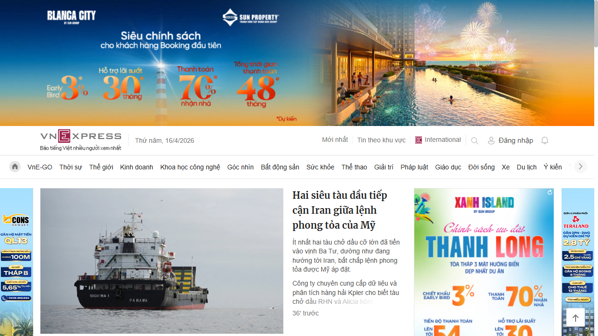
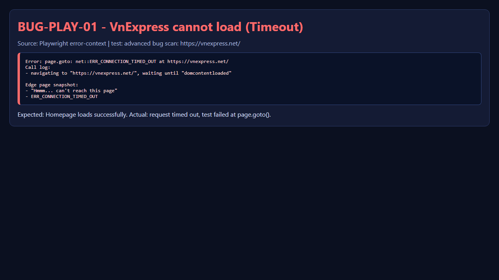
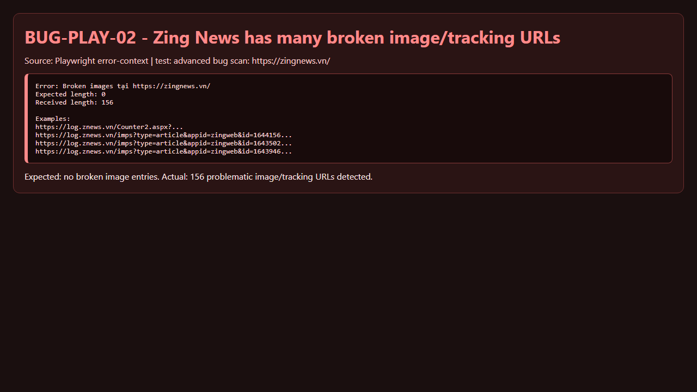
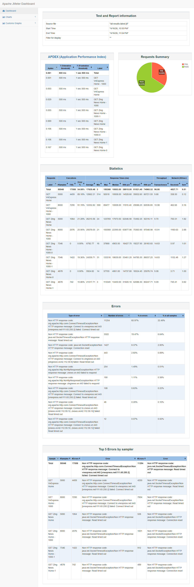
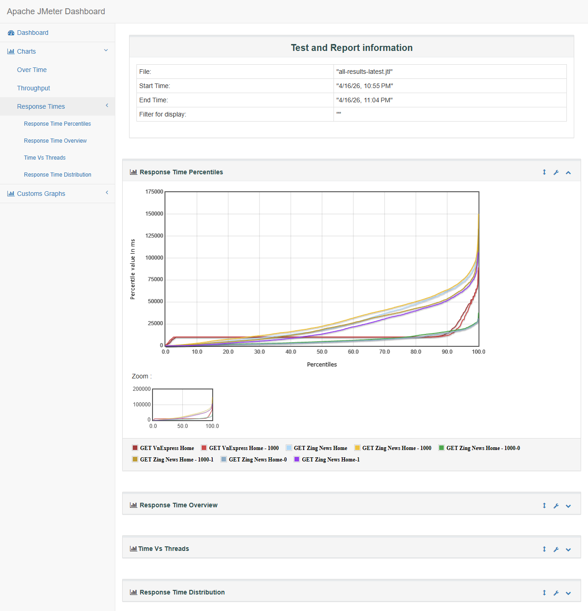

# 03 - Bug Report

## Tong quan
- Ngay chay: 2026-04-16
- Nguon bug: Playwright bug scan + JMeter stress test
- Link test:
  - https://vnexpress.net/
  - https://zingnews.vn/

## Danh sach bug phat hien

| Bug ID | Mo ta loi | Steps to Reproduce | Severity | Trang thai |
|---|---|---|---|---|
| BUG-PLAY-01 | VnExpress xuat hien nhieu console error tu ad/attestation endpoint (ERR_CONNECTION_REFUSED, 400) | 1. Chay `npx playwright test tests/news-bug-scan.spec.ts` 2. Mo test case `advanced bug scan: https://vnexpress.net/` 3. Xem error-context va screenshot fail | Medium | Open |
| BUG-PLAY-02 | Zing News co nhieu broken image/tracking pixel response bat thuong trong luong load trang | 1. Chay `npx playwright test tests/news-bug-scan.spec.ts` 2. Mo test case `advanced bug scan: https://zingnews.vn/` 3. Xem error-context va screenshot fail | Medium | Open |
| BUG-PERF-01 | VnExpress error rate rat cao khi stress 500-1000 users (89-91%) | 1. Chay `jmeter -n -t jmeter/NewsSites-Stress-500-1000.jmx -l jmeter/results/all-results-latest.jtl -e -o jmeter/results/html-report-latest` 2. Xem `statistics.json` 3. Kiem tra transaction `GET VnExpress Home` va `GET VnExpress Home - 1000` | High | Open |
| BUG-SEL-01 | Test TC07 (click đọc bài) fail ngẫu nhiên do click vào luồng nội dung đặc biệt, không có selector tiêu đề bài chuẩn | 1. Chạy `dotnet test .\\SeleniumVnExpress.csproj --filter "FullyQualifiedName~TC07_DocBai_ChiTietBaiViet" --logger "trx;LogFileName=results-tc07-rerun.trx"` 2. Quan sát timeout `NoSuchElement` tại selector `h1.title-detail...` 3. Kiểm tra screenshot fail trong `bin/Debug/net6.0/artifacts/selenium-failures/` | High | Closed |
| BUG-SEL-02 | Test TC09 relevance check quá nghiêm ngặt với dữ liệu live, gây false negative dù chức năng tìm kiếm vẫn hoạt động | 1. Chạy full suite cũ: `dotnet test .\\SeleniumVnExpress.csproj --filter "FullyQualifiedName~VnExpressSeleniumTests.VnExpressTests" --logger "trx;LogFileName=results-vnexpress-hardening-normal.trx"` 2. Quan sát fail tại TC09 do `relevantCount = 0` | Medium | Closed |
| BUG-SEL-03 | Test suite Selenium sử dụng `Thread.Sleep`, dẫn đến flaky/chậm và phụ thuộc tốc độ tải trang | 1. Mở file test và tìm `Thread.Sleep` 2. Chạy test trong điều kiện mạng chậm 3. Quan sát timeout/xung đột timing | Medium | Closed |
| BUG-SEL-04 | Thiếu screenshot theo từng bước và logging chi tiết nên khó điều tra lỗi khi test fail | 1. Chạy test phiên bản cũ 2. Khi fail chỉ có screenshot cuối, thiếu context thao tác 3. Khó truy vết nguyên nhân | Medium | Closed |
| BUG-SEL-05 | Cảnh báo không tương thích giữa msedgedriver và Microsoft Edge version (rủi ro phát sinh flaky) | 1. Chạy bất kỳ test Selenium 2. Quan sát warning: `WebDriver ... has not been tested with Microsoft Edge version 147` | Low | Open |

## Screenshot minh hoa (moi bug co anh)

### BUG-PLAY-01
- Anh context trang:

- Anh evidence loi:

### BUG-PLAY-02
- Anh context trang:

- Anh evidence loi:

### BUG-PERF-01

## Ghi chu
- Artifact Playwright: `test-results/news-bug-scan-advanced-bug-scan-https-vnexpress-net--Microsoft-Edge/` va `test-results/news-bug-scan-advanced-bug-scan-https-zingnews-vn--Microsoft-Edge/`
- Artifact JMeter: `jmeter/results/html-report-latest/` va `jmeter/results/all-results-latest.jtl`
